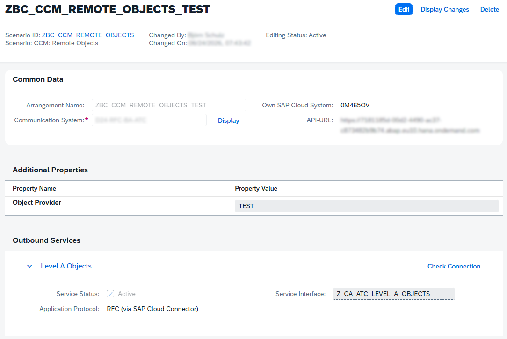
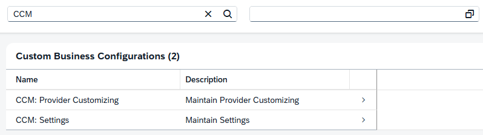
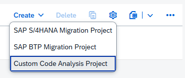
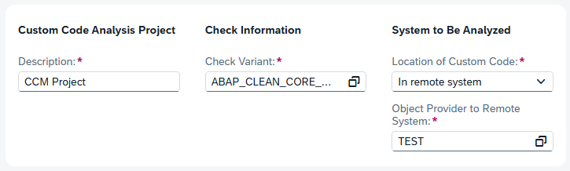
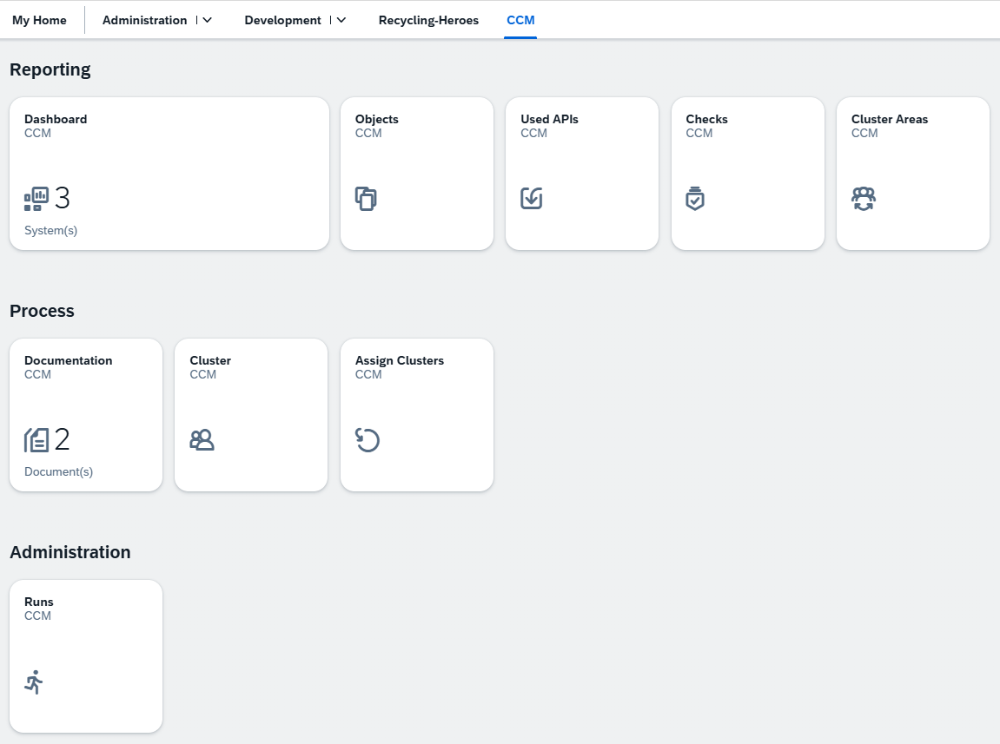
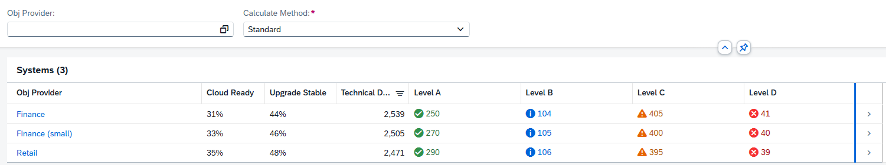
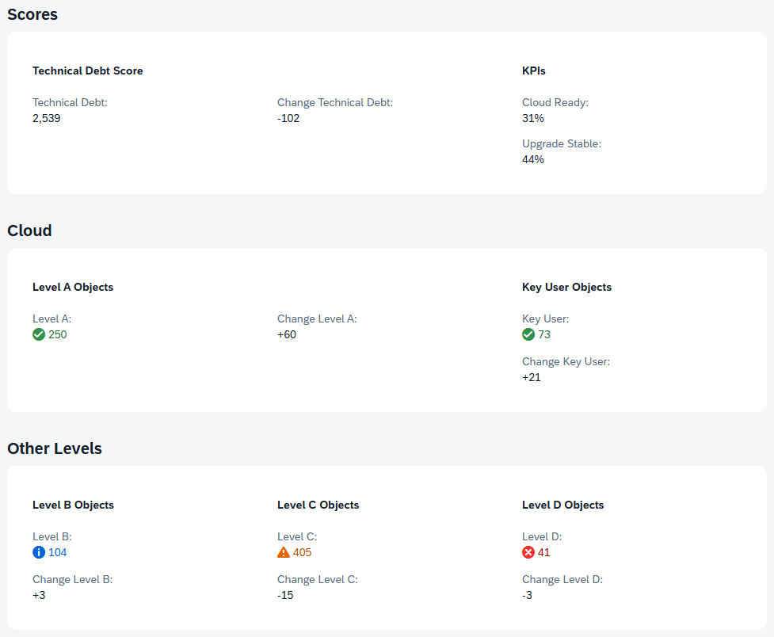
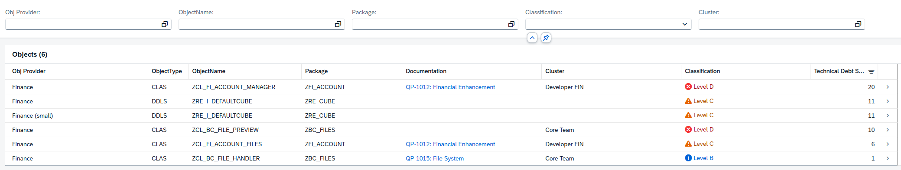

# Clean Core Measurement

- [General](#general)
- [Installation](#installation)
- [On-Prem](#on-prem)
- [Configuration](#configuration)
- [Demo](#demo)

## General

### Introduction

Do you want to track Clean Core metrics and view your KPIs for all systems at a glance? The CCM project provides you with a dashboard and various documentation tools to track your findings. The tool should run on the central ATC to enable process automation and easy access.

### Requirements

The project was designed to run on the same system as the Central ATC. We are testing the system in a SAP BTP ABAP environment where the ATC is configured against on-prem systems. Use within an on-prem Central ATC setup was not originally planned, but should be implementable with minimal effort (requiring API adjustments in the code).

### Features

The following features are currently available, and some are already planned for upcoming versions:

- Dashboard with KPI (Level A to D, Key User objects, Scores)
- Documentation and Assignment to developments
- Cluster (Product, Team, Group, Company) und assignment
- Detailed Messages, APIs and Objects
- Statistic over different clusters
- Import ATC data for calculation
- Custom KPI with Exemptions and Documentations *[Planned]*
- KPI and overview for Modifications *[Planned]*
- Diagram for Trend per system *[Planned]*
- Different roles, like Admin, Viewer, Developer *[Planned]*
- Authorization per system *[Planned]*

### Material

- [Clean Core Measurement - Overview](https://software-heroes.com/en/blog/abap-cloud-ccm-overview)
- [CCM - Determination of Level A Objects](https://software-heroes.com/en/blog/abap-ccm-determination-of-level-a-objects)
- [CCM - Standard APIs](https://software-heroes.com/en/blog/abap-ccm-standard-apis-en)

## Installation

Here you find some information, how to install the project in your system. Currently, the installation process is somewhat more complex because the BSP applications are not synchronized using the abapGit plugin.

### ABAP sources

Use the abapGit plugin in your system to import the repository along with all its objects. Finally, perform a mass activation to ensure the objects are actively created in the system.

### Fiori Apps

Clone the application into Business Application Studio (BAS) or VS Code. Next, create a deployment configuration for your system, using the BSP application name as described below. The deployment target is the package ``ZBC_CCM_FIORI``, which you previously created using abapGit.

| App Name | BSP Name | GitHub Repo |
|---|---|---|
| CCM Area | ZBC_CCM_AREA | https://github.com/Xexer/zbcccmarea |
| CCM Assign | ZBC_CCM_ASSIGN | https://github.com/Xexer/zbcccmassign |
| CCM Checks | ZBC_CCM_CHECK | https://github.com/Xexer/zbcccmchecks |
| CCM Cluster | ZBC_CCM_CLUSTER | https://github.com/Xexer/zbcccmcluster |
| CCM Dashboard | ZBC_CCM_DASHBO | https://github.com/Xexer/zbcccmdashboard |
| CCM Document | ZBC_CCM_DOC | https://github.com/Xexer/zbcccmdocument |
| CCM Objects | ZBC_CCM_OBJECT | https://github.com/Xexer/zbcccmobjects |
| CCM Run | ZBC_CCM_RUN | https://github.com/Xexer/zbcccmrun |
| CCM Used APIs | ZBC_CCM_USEDAPI | https://github.com/Xexer/zbcccmusedapis |
| CCM Used Messages | ZBC_CCM_USEDMSG | https://github.com/Xexer/zbcccmusedmessage |

## On-Prem

If you want to extract numbers automatically, you have to configure the connection and install additional components.

### ABAP source

If you want to get the number of Level A and Key User objects from your On-Prem system, you should install the function module [Z_CA_ATC_LEVEL_A_OBJECTS](/notes/extract-fm.abap) in your connected systems.

### Authorization

If you have installed the function module(s) for the On-Prem extraction, you should also enhance the role for your technical ATC user in this system. Use the authorization for the function module **OR** the function group.

Function Module (S_RFC):
- RFC_TYPE - FUNC
- RFC_NAME - Z_CA_ATC_LEVEL_A_OBJECTS
- ACTVT - 16

Function Group (S_RFC):
- RFC_TYPE - FUGR
- RFC_NAME - <YOUR_FUGR>
- ACTVT - 16

### Cloud Connector

Add the function modules to the Cloud Connector configuration, so the system can have access to you On-Prem system and the function module. You have to add every FM as "exact":

- Z_CA_ATC_LEVEL_A_OBJECTS - Extract Level A and Key User objects

### Communication Arrangement

If you have implemented the function modules On-Prem, you also need an additional Communication Arrangement per backend system. Use the Scenario ID "ZBC_CCM_REMOTE_OBJECTS", set the object provider and reuse the Communication System. The framework will only call backend systems, that have a configured Object Provider to match the system.



## Configuration

Here you find important points to configure your system to use the project.

### Authorization

To use the Business Configuration and the apps, you need to create a Business Role in the system and add the following Business Catalogs:

- ZBC_CCM_ADMIN - All authorizations for CCM including Configuration and Apps
- SAP_CORE_BC_BCT_MBC_PC - Use Business Configuration in the system
- SAP_CORE_BC_CCM - Custom Code Migration App

Add also the default Launchpad Space "ZBC_CCM_SPACE" that we deliver with the ABAP project or create a custom one. Search in the Custom Business Configuration App for "CCM" to find available configuration options.



### Configuration: Settings

First configure the settings to enable standard proccess in the system.

| Setting | Options | Description |
|---|---|---|
| Default ATC Variant | ABAP_CLEAN_CORE_READINESS | Configure the ATC variant you run to do the Clean Core checks against the systems |
| Period (W/M) | M = Month or W  = Weekly | How often your measurement should run and for the output period |
| Level B (Score) | 1 | Points to calculate the technical debt in the system for all Information messages from ATC | 
| Level C (Score) | 5 | Points to calculate the technical debt in the system for all Warning messages from ATC |
| Level D (Score) | 10 | Points to calculate the technical debt in the system for all Error messages from ATC |
| Level C for Clean Core | X | When set to 'X', also the Level C findings count to the Upgrade-Stable KPI |
| Mail: Sender | [Mail] | Sender of the notification mail, if you use a fixed one |
| Mail: Receiver | [Mail] | All receivers that will get an e-mail, after the job created a new scoring |
| Test Mode | X | When set to 'X', you can run the job to fill the tables with test data to test the functionallity |

### Configuration: Object Provider

Create the object providers, by synchronizing the ATC systems to this configuration table. After the sync you should configure you systems to use them in the dashboard and all other apps.

1. Use action "Sync Providers" to synchronize all configured object providers from ATC. Base is here the Communication Scenario "SAP_COM_0464" and all configured Communication Arrangements.
2. Group you systems, if one or more are in the same system landscape.
3. Activate or deactivate a system. A deactivated system is not visible in the CCM.
4. Set a display name for the system. It's visible in all apps instead of the System ID/Object Provider ID.
5. Set "Only Scores", if you don't want to save objects in the system. Only the scores are calculated than.
6. Custom Code Analysis Project ID, you will get in the next step (ATC Automation).

### ATC Automation

To automate your Clean Core Measurement process, you have to plan the Clean Core checks for every Object Provider for your own. Due to missing APIs the project could not generate the project nor start the run.

#### Custom Code Analysis

Go to the app "Custom Code Migration" an create a new "Custom Code Analysis Project".



Chosse a name for the Analysis and set you check variant. The default is ABAP_CLEAN_CORE_READINESS and the variant should match your configuration. Set the system to "In remote system" and configure the Object Provider.



You can adjust the "Advanced Configuration" if you want to include or exclude additional packages. Remove the flag from "Start Analysis at Project Creation", so that the project is only created in the system. After creation you can navigate into the project and find the Project ID in the URL. Copy only the GUID between the Quotation marks and insert it in the provider configuration (Step 6). Here an example of the URL:

```
/sycm_aps_c_project(project_id=guid'b65d2e89-1408-1fd0-a3e7-de558b9f5cb1',IsActiveEntity=true)
```

#### Automation (Analysis)

After project creation go to the app "Application Jobs" and create a reccuring job for the Custom Code Analysis. Plan it for the period you have configured (week or month). The runtime depends on the size of the system. You can get a number, after running a system for the first time and if you check the logs.


#### Automation (CCM)

To calculate the results and create you base data, you have to plan at the end the scheduler for CCM. You create a job, when you think that all runs are finished and are ready to import the result. The job will calculate the results, refresh the tables and create a notification for you, if you have configured an e-mail.


### Test Data

We also deliver some test data, to test and see the functionallity in the project. To load the data you have to set the "Test Mode" flag in the Business Configuration. After you have set this flag you can run the Application Job "CCM: Preview Data" with the flags:

- Delete data - Delete all data form the tables, could also be used to clean up the tables at the end of the test period.
- Insert data - Create demo data in all tables with it's own model and usage.

## Demo

The screenshot are made with the test data we also deliver with the implementation, if you want to take a look.

### Launchpad Space

If you use the default space, you will find all applications under "CCM". Here you can navigate to all relevant applications. The example screenshot is with all apps as an administrator.



### Dashboard

The Dashboard is the heart of your analysis. Here you get a quick overview over your whole landscape and you can quickcheck the KPIs for the system. You can switch between the different calculation methods, the standard is the raw view on your system.



In the details you get more information, how you score and the numbers have changed after the last run. Here you also get more details about numbers for Key User objects.



### Objects

In the objects you can navigate to the details for all system or per system. The list is ordered by Technical Debt Score and you get also the classification for an object. If you have configured Documentations or Clusters, the objects will assign to them, to give you a better understanding of relations and responsibility.



### Video

tbd
